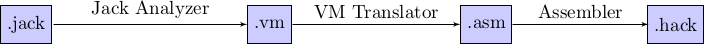

# NandToTetris

*Date du projet : février 2014 à avril 2014*

Projet NandToTetris du livre *The Elements of Computing Systems : Building a Modern Computer from First Principles*.

## Qu'est-ce que NandToTetris ?

NandToTetris signifie littéralement *"De la porte NAND (NON ET) à Tetris"*, on va donc partir d'une [porte logique](https://fr.wikipedia.org/wiki/Fonction_logique) pour construire un ordinateur fonctionnel et complet afin de pouvoir programmer dessus et éventuellement réaliser des jeux comme Tetris.

Le projet consiste donc à créer :

- un **ordinateur** capable d'être émulé.
- un **compilateur** complet pour le langage Jack (le langage de base de l’ordinateur).
- un **mini-OS** nous permettant d'avoir des appels systèmes basiques.

J’ai réalisé ce projet à l’aide du livre *The Elements of Computing Systems : Building a Modern Computer from First Principles*, il fournit des émulateurs et des fichiers de tests pour la création de ce projet, ainsi que les explications nécessaires.

### L'ordinateur

L'ordinateur est basé sur une architecture 16 bits de [von Neumann](https://fr.wikipedia.org/wiki/Architecture_de_von_Neumann), et peut accueillir un clavier et un écran de 256×512 en noir et blanc.

Pour la création de l'ordinateur, on va donc partir de la porte logique [NAND](https://fr.wikipedia.org/wiki/Fonction_NON-ET) qui est notre élément de base (elle est intégrée directement dans l'émulateur ce qui nous permet de l'utiliser avec les autres éléments sans problème). Grâce à cette porte logique, on peut en créer d'autres comme [AND](https://fr.wikipedia.org/wiki/Fonction_ET), [OR](https://fr.wikipedia.org/wiki/Fonction_OU), [NOT](https://fr.wikipedia.org/wiki/Fonction_NON), etc. et à partir de ces portes on peut construire l’[ALU](https://fr.wikipedia.org/wiki/Unit%C3%A9_arithm%C3%A9tique_et_logique). Pour la [RAM](https://fr.wikipedia.org/wiki/M%C3%A9moire_vive) de l'ordinateur, il faut la construire étape par étape et augmenter progressivement en capacité de stockage. On commence par la construction d'un [flip-flop](https://fr.wikipedia.org/wiki/Bascule_%28circuit_logique%29) qui nous permet de réaliser un [bit](https://fr.wikipedia.org/wiki/Bit), puis un registre et enfin la RAM complète. Le [CPU](https://fr.wikipedia.org/wiki/Processeur) vient en dernier et achève la création de notre ordinateur.

Toutes les parties de l’ordinateur sont créées à partir de fichiers .hdl qui peuvent être simulés à l’aide du CPU Emulator fournit par le livre.

### Le compilateur

Ensuite on crée le compilateur (à partir de n’importe quel langage, j’ai choisi le C) qui est constitué d’une [machine virtuelle](https://fr.wikipedia.org/wiki/Machine_virtuelle).



Il est décomposé en 3 programmes :

- **Jack Analyzer** : Ce programme nettoie les fichiers .jack (enlève les commentaires, les espaces blancs inutiles etc.), puis il traduit pour chaque fichier .jack son équivalent en .vm (langage de la machine virtuelle).
- **VM Translator** : Ce programme traduit tous les .vm en un seul fichier .asm (assembleur, langage de l’ordinateur).
- **Assembler** : Ce programme traduit le fichier .asm en un seul fichier binaire .hack (exécutable par l’ordinateur).

L’intérêt d’avoir une machine virtuelle est que si je veux par exemple ajouter un langage de programmation sur l’ordinateur, il me suffit de créer un programme qui traduit du nouveau langage en langage de la machine virtuelle et donc je ne recode pas inutilement la partie VM Translator et Assembler.

### Le mini-OS

Enfin on crée le mini-OS qui est plutôt une librairie qui fournit des fonctions de bases et des appels systèmes pour le langage Jack. Le tout codé en Jack, contenant presque 50 appels systèmes répartis en 8 fichiers sources :

- **Math** : Fonctions mathématiques de base.
- **String** : Crée la classe String ainsi que plusieurs fonctions permettant de manipuler les chaînes de caractères.
- **Array** : Crée la classe Array.
- **Output** : Permet d’afficher du texte, des nombres etc. sur l’écran.
- **Screen** : Permet d’afficher des lignes, des rectangles, des cercles etc. sur l’écran.
- **Keyboard** : Permet de lire sur l’entrée de l’ordinateur (le clavier) des nombres, des caractères, des chaînes etc.
- **Memory** : Permet d’allouer et de dé-allouer des objets et définit quelques appels systèmes sur la mémoire.
- **Sys** : Fournit quelques appels systèmes sur l’ordinateur comme une fonction arrêtant le programme en cours, une fonction en cas d’erreur, une fonction qui attends un certains nombres de millisecondes.


## Le langage Jack

Le langage de programmation Jack est un langage simple orienté objet dont vous pouvez trouver une description complète ici : <http://www.nand2tetris.org/09.php>

Un exemple de programme affichant "Hello world !" en Jack :

```java
class Main
{
   function void main()
   {
      do Output.printString("Hello world !");
      do Output.println();

      return ;
   }
}
```

## Lien

Le site du livre : <http://www.nand2tetris.org/>

D'autres liens utiles à propos du projet :

- L'intégralité du livre en format .pdf : <http://www.nand2tetris.org/course.php>
- Le livre en format paper : <http://www.nand2tetris.org/book.php>
- Tous les fichiers fournit avec le livre (émulateurs, fichiers tests etc.) : <http://www.nand2tetris.org/software.php>
